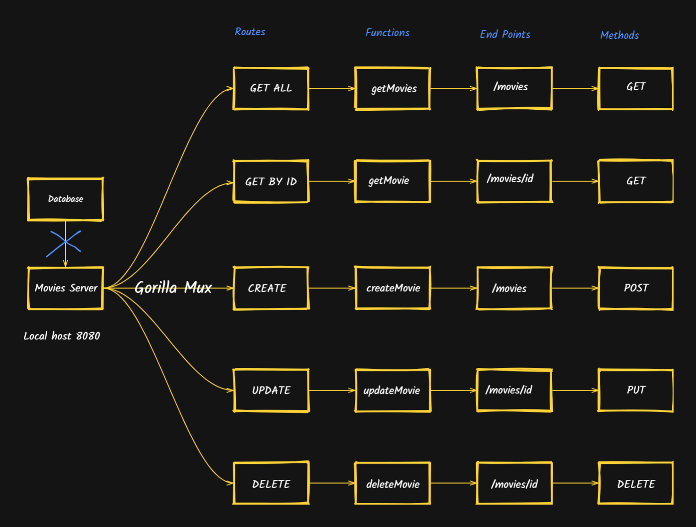
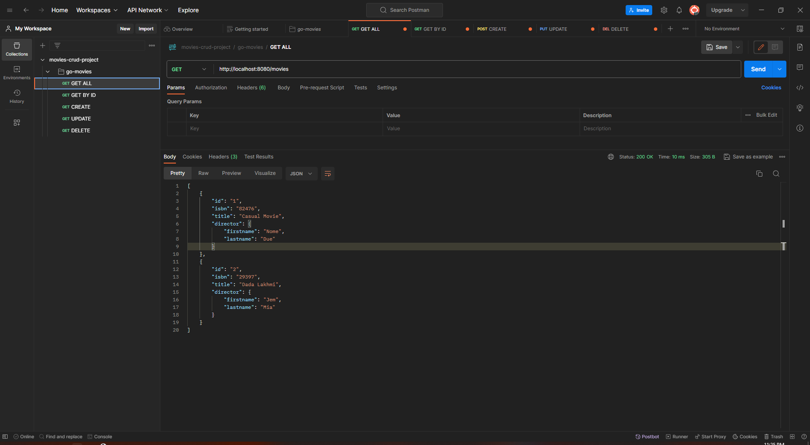
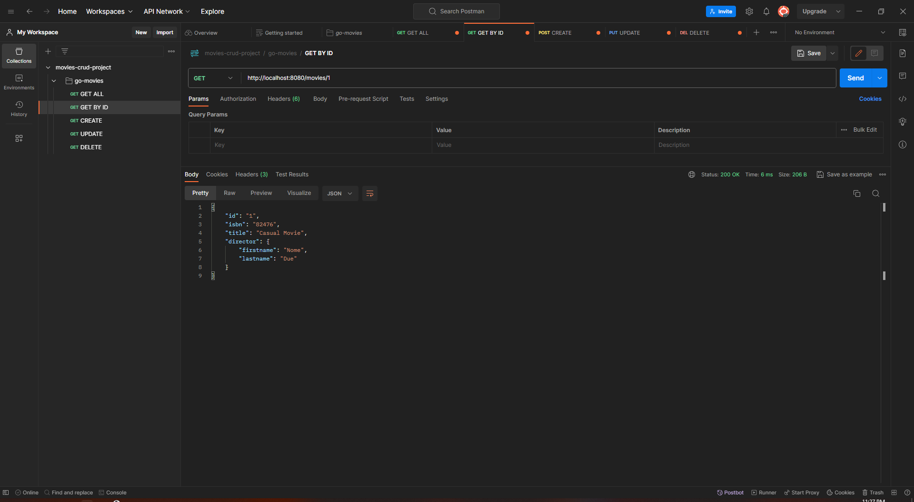
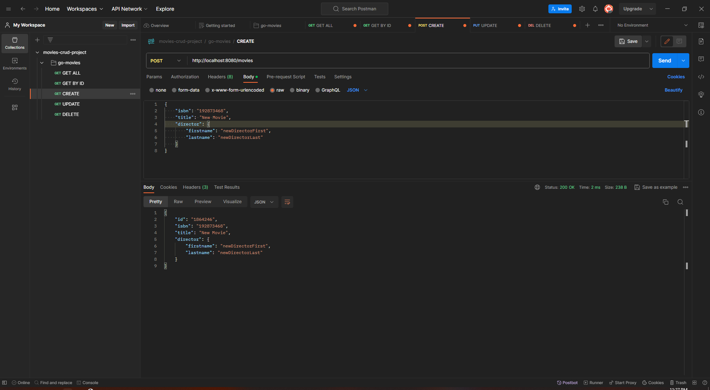
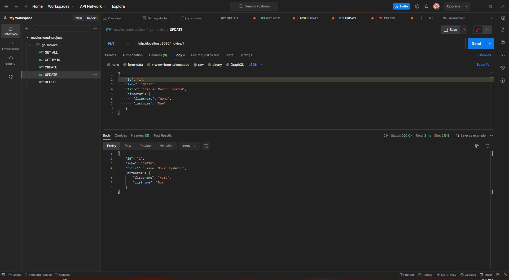
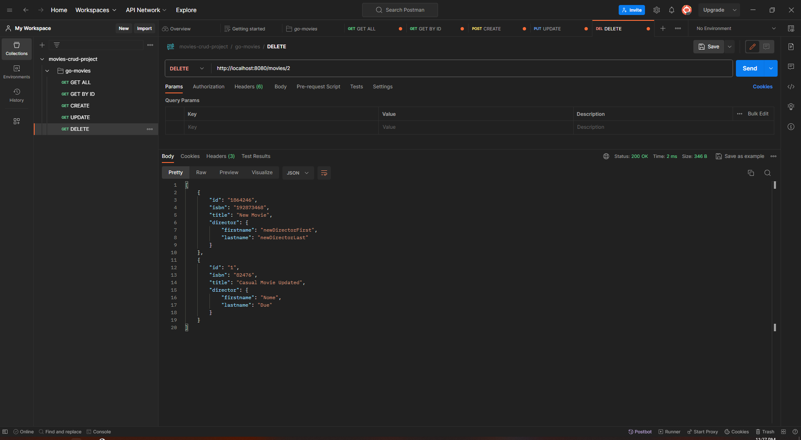

# CRUD API with Golang

Simple Project CRUD API (Movies)

* Gorilla Mux

* Post Man

* GOLANG

* * *

Every single one have a corresponding routes

Two types of endpoints /movies/id

* * *

# Architecture Design 

### Testing APIs using POST MAN

#### GET ALL (GET)

#### GET BY ID

#### CREATE

#### UPDATE

#### DELETE

